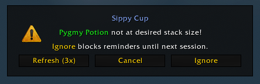
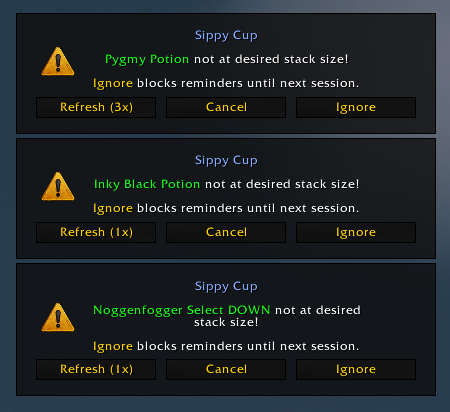
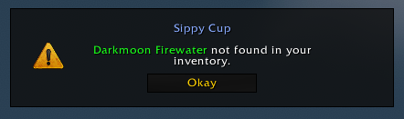

# Sippy Cup 🥤
Sippy Cup tracks and reminds you of your roleplay consumables, helping keep you focused on what matters most: Roleplay.

## How it works
Once enabled, Sippy Cup will display a reminder popup when your consumable runs out or when your current stack count falls below your desired amount.

Note: To minimize login popups, only active consumables with stack counts below your desired amount will display reminders on login.

If multiple consumables expire simultaneously, Sippy Cup will display multiple popups.  
Due to WoW's limit of four simultaneous pop-ups, the oldest reminder will be dismissed if a fifth one appears.

If an item cannot be refreshed due to its absence from your inventory, a notification message will appear.

## Reminder Settings

### Effect
Manage reminders for consumables that apply effects to your character or the environment.

Examples:
- [Elixir of Tongues](https://www.wowhead.com/item=2460/elixir-of-tongues)
- [Inky Black Potion](https://www.wowhead.com/item=124640/inky-black-potion)
- [Sacredite's Ledger](https://www.wowhead.com/item=234527/sacredites-ledger)

### Size
Manage reminders for consumables that alter your character's size.

Examples:
- [Darkmoon Firewater](https://www.wowhead.com/item=124671/darkmoon-firewater)
- [Elixir of Giant Growth](https://www.wowhead.com/item=6662/elixir-of-giant-growth)
- [Pygmy Oil](https://www.wowhead.com/item=40195/pygmy-oil)
