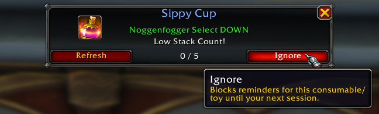
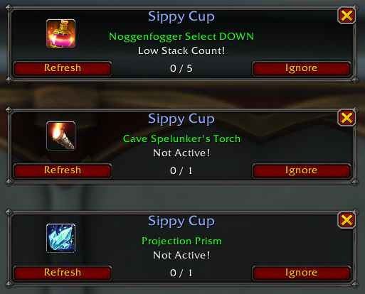
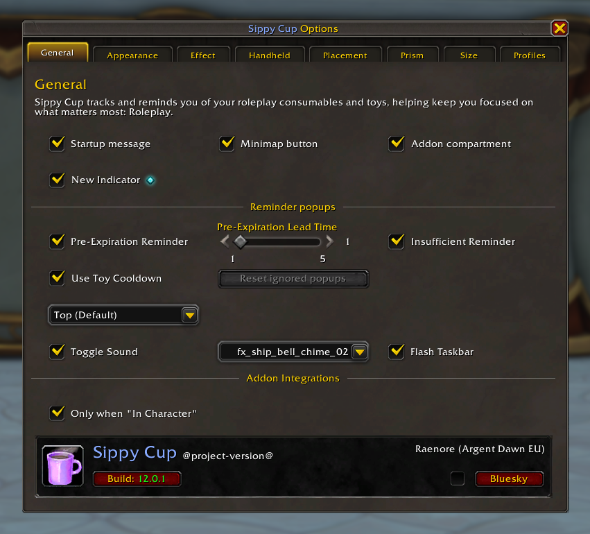
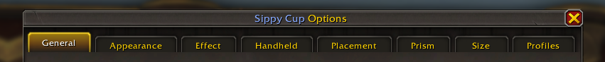
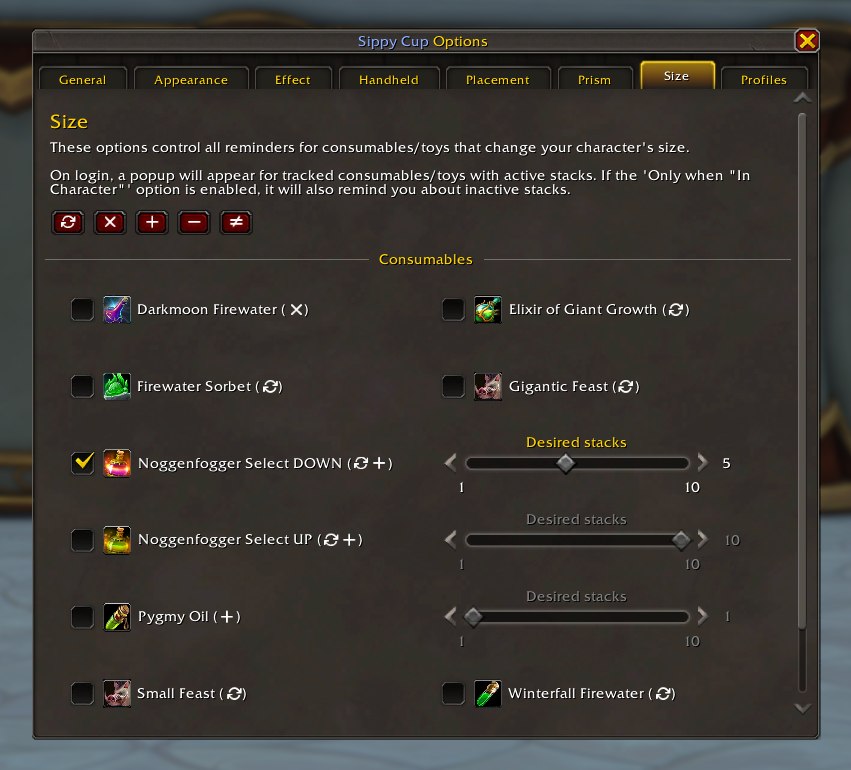

# Sippy Cup 🥤
Sippy Cup tracks and reminds you of your roleplay consumables and toys, helping keep you focused on what matters most: *Roleplay*.  

**Key Features:**
- **Smart Reminders:** Automatic popups when items expire, run low, or are missing from your inventory.
- **Roleplay Integration:** Optional "In Character" detection to only trigger reminders during active RP.
- **Queue System:** Manages multiple expiring items by queuing up to 5 active popups at once.
- **Visual & Audio Alerts:** Customizable screen positioning, sound notifications, and taskbar flashing.
- **Extensive Library:** Built-in support for character transformations, size modifiers, and world placements.

Available on [CurseForge](https://www.curseforge.com/wow/addons/sippy-cup), [Wago.io](https://addons.wago.io/addons/sippy-cup), and [WoWInterface](https://www.wowinterface.com/downloads/info26933-SippyCup.html)!  

## How It Works
Once enabled, Sippy Cup monitors your tracked items and displays a reminder popup based on the following triggers:
- **Expiration:** Your consumable runs out (or is about to, if pre-expiration is enabled).
- **Low Stock:** Your current stack count is below your desired threshold.
- **Missing Items:** You lack the necessary items required for your next refresh round.

**Note:** On login, a popup will appear for tracked consumables/toys with active stacks. If the **Only when "In Character"** option is enabled, it will also remind you about inactive stacks.

### Multi-Popup Management
If multiple items expire simultaneously, Sippy Cup displays multiple popups.
A maximum of 5 popups are shown at once, additional reminders are queued and appear as you dismiss or resolve the current ones.

### Status Indicators
If an item cannot be refreshed due to missing or insufficient stock, the refresh button displays a warning-colored tooltip.

<table>
  <tr>
    <td></td>
	<td></td>
  </tr>
  <tr>
    <td></td>
    <td></td>
  </tr>
</table>

If the **Insufficient Reminder** option is enabled (disabled by default), Sippy Cup will remind you if you don't have enough of the item for your next refresh.

<table>
  <tr>
    <td></td>
    <td></td>
  </tr>
</table>

## General Settings
Adjust Sippy Cup's settings to match your personal preferences by using `/sc` or `/sippycup`.

Here you can:  
- Toggle a **Startup message** at login that displays current profile and version.  
- Control the visibility of the **Minimap button**.  
- Configure display of the addon in Blizzard's **Addon compartment**.

**Reminder Customization:**
- **Alerts:** Choose custom sounds and toggle taskbar flashing for urgent reminders.
- **Pre-expiration:** Get notified before an effect wears off to ensure seamless RP.
- **Insufficient Reminder:** Enable alerts specifically for when you are low on stock (disabled by default).
- **Placement:** Position popups at the Top, Center, or Bottom of your screen.

Sippy Cup also offers a special integration:  
- **Only when "In Character"**: Limits checks to when your character is flagged as "IC" (Requires TRP3, MRP, or XRP).

At the bottom of this page, you’ll find information about your current version of Sippy Cup.

## Reminder Categories
Sippy Cup categorizes items to help you manage specific types of RP effects. You can enable or disable individual items within them.

**Available Categories:**
- **Appearance:** Alters your character’s visual appearance.  
- **Effect:** Applies a temporary effect to your character or the environment.  
- **Handheld:** Places an item in your character’s hand(s).  
- **Placement:** Creates objects in the game world.  
- **Prism:** Changes your appearance.  
- **Size:** Alters your character’s size.

[Click here for a complete list of supported consumables/toys](https://github.com/Raenore/Sippy-Cup/wiki#supported-options).

Below you can find a screenshot of the **Size** category for reference.

